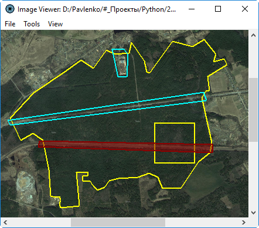
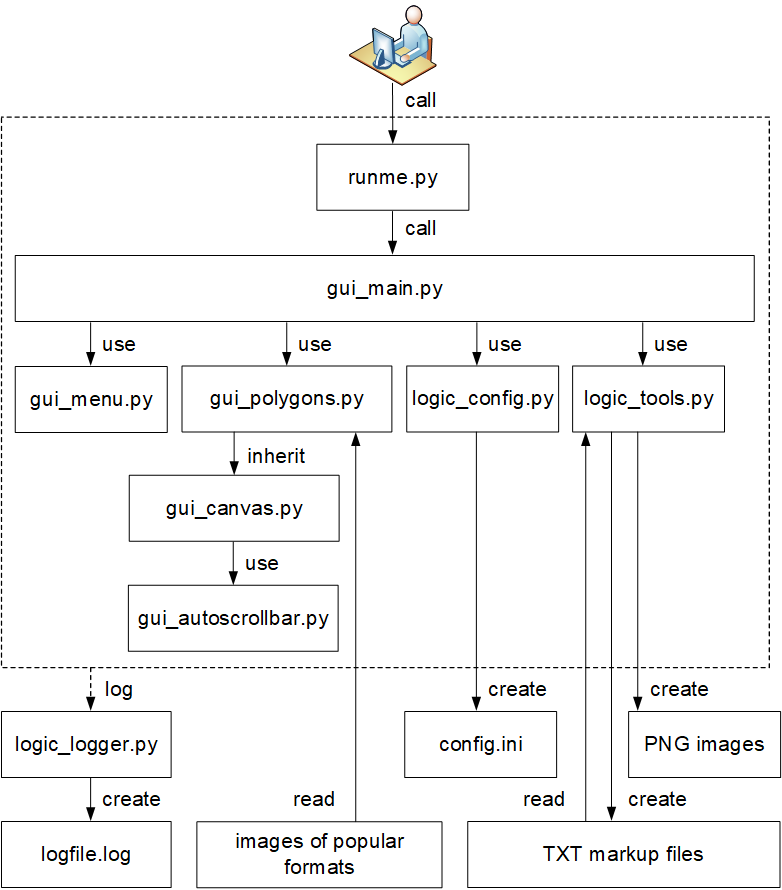

##### Manual image annotation with polygons



Manual image annotation opens image where user can select
polygon areas around the objects of interest.

After selecting region of interest user presses menu button
and program cuts rectangular images from selected polygons
with a scanning window.

Parameters of the scanning window are set in the configuration INI file `config.ini`,
which is in the `temp` directory.

The output of the application is the set of rectangular
images from the polygon areas in the `temp` directory.

Also it saves polygon areas for the image in TXT format.
You could open saved areas, modify them and cut image again.

Tested on **Windows** and **Ubuntu** for Python **3.7**.

External libraries:
   * **Pillow** to open images of [various formats](https://pillow.readthedocs.io/en/stable/handbook/image-file-formats.html).
   * **NumPy** to use matrix [stride tricks](https://docs.scipy.org/doc/numpy-1.15.0/reference/generated/numpy.lib.stride_tricks.as_strided.html).

To start Manual Image Annotation with polygons:
```shell
# Install additional packages
pip install pillow numpy
# Run it
python runme.py
```

Software architecture:

