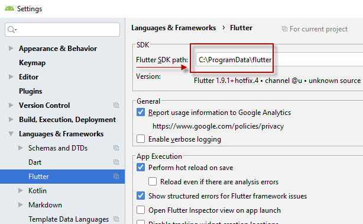
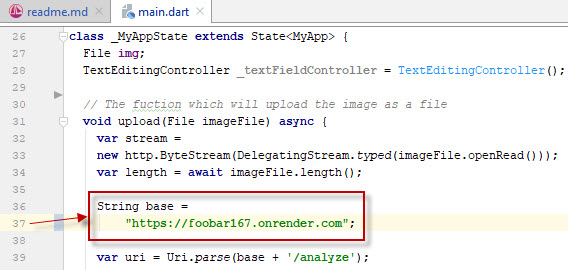

## Build mobile app
   * [Install](https://flutter.dev/docs/get-started/install) Flutter.
     Run `flutter doctor` in console. Resolve problems with certificates and
     [plugins](https://stackoverflow.com/a/52816669/7550928).  
       
   * Download and open [this code](.) in Android Studio as a new Flutter project.  
   * It will ask you to 'get' all dependencies, say yes and it'll will all be installed automatically. 
     If you get error `Because flutter_app11 depends on flutter_test any from sdk which doesn't exist
     (the Flutter SDK is not available), version solving failed`. Then you need to configure path to
     Flutter in project settings: `File --> Settings --> Languages & Frameworks --> Flutter -->
     Flutter SDK path`. Enter your path to Flutter directory.  
       
   * Replace the default render link in [`main.dart`](lib/main.dart)
     to the link to your deployed render app.  
       
     [Dart](https://dart.dev) is a client-optimized programming language for fast apps
     on multiple platforms. It is developed by Google and is used to build mobile,
     desktop, backend and web applications.  
   * Notice the 2 functions `user_signup` and `user_login`
     in the [`main.dart`](lib/main.dart) file.
     This is where your stripe and firebase authentication code will be placed
     to make your app commercial.  
